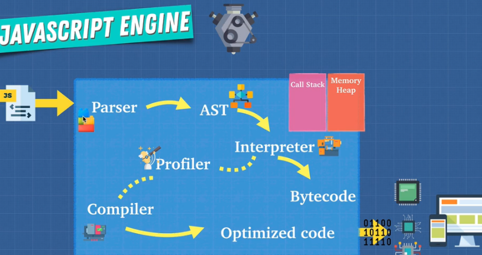

# Top Level Heading

[Andrei's course Cheatsheet](https://zerotomastery.io/courses/advanced-javascript/cheatsheet/)

## Javascript Engine

What a javascript engine does:

## JIT compiler

A mix of compilation and interpretation. Code is interpreted first, and a profiler inspects the code and delivers code that may be optimized to a compiler

## Memory Leaks

Clean ClearInterval and EventListeners to reduce the chance of memory leaks. Even though Javascript has a garbage collector, it isn't perfect, so memory considerations shouldn't be ignored entirely.

## Use Strict

'use strict':

-prevents global leakage

## Block Scope

In Javascript, variables within a block scope are still in memory after the block scope terminates, but they cannot be accessed. By contrast, in a language such as C++, once the scope is exited, the memory is released for stack allocated variables.

## this

"this" is dynamically scoped. Where it is written doesn't matter, only where it's called.
Arrow functions are lexically binded, which can get over common scope problems when using the this keyword within a function of an object.

## For in

Avoid using for in to iterate an object because by using for in, the elements of the entire prototype chain are obtained. Instead, use Object.keys to obtain an array of keys.
